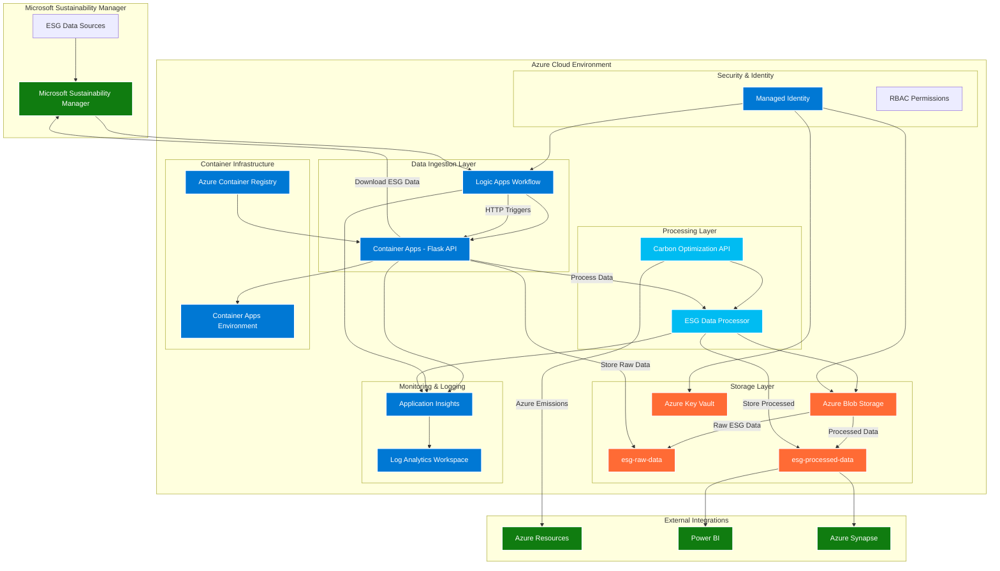

# ESG Reporting - Microsoft Sustainability Manager to Azure Integration

A comprehensive Python-based solution for automating ESG data export from Microsoft Sustainability Manager, uploading to Azure Blob Storage, and processing via Azure services.

## 🏗️ Architecture Overview



## 🚀 Features

- **Automated Data Processing**: Process ESG data from various formats (CSV, Excel, JSON)
- **Azure Integration**: Seamless connection to Azure Blob Storage with managed identity support
- **Azure Carbon Optimization**: Direct integration with Azure Carbon Optimization API for real emissions data
- **Secure Configuration**: Azure Key Vault integration for secrets management
- **Monitoring & Logging**: Azure Monitor integration with structured logging
- **Command Line Interface**: Easy-to-use CLI for all operations
- **Robust Testing**: Comprehensive test suite with pytest
- **Infrastructure as Code**: Azure resources defined with Bicep templates

## 📋 Prerequisites

- Python 3.8 or higher
- Azure subscription
- Azure Developer CLI (azd) - [Install azd](https://learn.microsoft.com/en-us/azure/developer/azure-developer-cli/install-azd)
- Access to Microsoft Sustainability Manager

## 🛠️ Quick Start

### 1. Prerequisites

- **Azure subscription** with appropriate permissions
- **Azure Developer CLI (azd)** - [Install azd](https://learn.microsoft.com/en-us/azure/developer/azure-developer-cli/install-azd)
- **Azure CLI** - [Install Azure CLI](https://docs.microsoft.com/en-us/cli/azure/install-azure-cli)
- **Python 3.8+** with pip

### 2. Clone and Setup

```bash
git clone <repository-url>
cd ESGReporting

# Authenticate with Azure
az login

# Install Python dependencies
pip install -r requirements.txt
pip install -e .
```

### 3. Deploy to Azure (One Command!)

```bash
# Option 1: Use the automated deployment script (Recommended)
.\deploy-with-rg.ps1

# Option 2: Use azd directly (requires manual resource group creation)
azd up
```

**The automated deployment script (`deploy-with-rg.ps1`) will:**
- Automatically create the required resource group
- Deploy all Azure resources using Bicep templates
- Configure authentication and permissions
- Set up monitoring and logging
- Use the single `esg-prod` environment consistently

**Azure Resources Created:**
- Azure Storage Account (for ESG data)
- Azure Key Vault (for secrets)
- Azure Container Apps (for hosting)
- Azure Container Registry (for container images)
- Log Analytics & Application Insights (for monitoring)
- Managed Identity (for secure authentication)
- Logic Apps (for ESG workflow automation)

### 4. Verify Deployment

```bash
# Check deployment status
azd show

# Test CLI functionality
esg-reporting --help

# Run tests
pytest tests/ -v
```

## 📖 Usage

### Command Line Interface

The ESG Reporting tool provides a comprehensive CLI for all operations:

```bash
# Upload a file to Azure Blob Storage
esg-reporting upload /path/to/data.csv --container raw-data

# Process ESG data with validation and transformation
esg-reporting process /path/to/data.csv --output processed_data.csv

# List files in Azure Blob Storage
esg-reporting list --container raw-data

# Download processed data
esg-reporting download processed_data.csv --container processed-data
```

### Processing ESG Data

```python
from esg_reporting.processor import ESGDataProcessor

# Initialize processor
processor = ESGDataProcessor()

# Load and process data
data = processor.load_data("sustainability_data.csv")
validated_data = processor.validate_data(data)
processed_data = processor.process_data(validated_data)

# Save results
processor.save_data(processed_data, "processed_output.csv")
```

### Azure Storage Integration

```python
from esg_reporting.storage import BlobStorageClient

# Initialize client (uses managed identity)
client = BlobStorageClient()

# Upload file
client.upload_file("local_file.csv", "container-name", "remote_file.csv")

# Download file
client.download_file("container-name", "remote_file.csv", "local_download.csv")

# List files
files = client.list_files("container-name")
```

## 🔄 Recommended Workflow

### 1. Automated ESG Data Download via Logic Apps
The Logic App automatically:
- **Connects to Microsoft Sustainability Manager** using configured credentials
- **Downloads ESG data** on schedule or manual trigger
- **Uploads raw data** to Azure Blob Storage
- **Triggers processing** workflow automatically

```bash
# Manual trigger for downloading all ESG data types
curl -X POST [LOGIC_APP_URL] \
  -H "Content-Type: application/json" \
  -d '{"processType": "download-all"}'

# Download specific ESG data types
curl -X POST [LOGIC_APP_URL] \
  -H "Content-Type: application/json" \
  -d '{"processType": "download-emissions"}'

curl -X POST [LOGIC_APP_URL] \
  -H "Content-Type: application/json" \
  -d '{"processType": "download-activities"}'
```

### Available API Endpoints

The deployed Flask API provides the following endpoints for ESG operations:

#### ESG Data Download Endpoints
- `POST /api/download/all` - Download all ESG data types from Microsoft Sustainability Manager
- `POST /api/download/emissions` - Download emissions data specifically
- `POST /api/download/activities` - Download activities data specifically

#### Processing & Monitoring Endpoints
- `POST /api/process` - Process existing ESG data files
- `POST /api/log` - Application logging endpoint
- `POST /api/notify` - Send notifications and alerts
- `POST /api/carbon/fetch` - Fetch carbon optimization data
- `GET /api/health` - Health check endpoint

#### Example API Calls

```bash
# Download all ESG data
curl -X POST https://[YOUR-CONTAINER-APP].azurecontainerapps.io/api/download/all \
  -H "Content-Type: application/json"

# Download emissions data only
curl -X POST https://[YOUR-CONTAINER-APP].azurecontainerapps.io/api/download/emissions \
  -H "Content-Type: application/json"
```

### 2. Azure Carbon Optimization Integration
```bash
# Logic App can also fetch Azure emissions data
# This is triggered automatically or manually
esg-reporting azure fetch --subscription-id YOUR_SUB_ID \
  --report-type monthly_summary --start-date 2024-01-01 --end-date 2024-12-31 \
  --output azure_emissions.csv
```

### 3. Automated Processing Pipeline
Once data is downloaded, the Logic App automatically:
- **Validates data** format and structure
- **Processes data** with transformations
- **Stores processed data** in designated containers
- **Sends notifications** on completion/failure

### 4. Integration with Azure Services

The solution integrates with:
- **Azure Data Factory**: For orchestrating complex data pipelines
- **Azure Synapse Analytics**: For advanced analytics and reporting
- **Azure Logic Apps**: For workflow automation and notifications
- **Power BI**: For ESG reporting dashboards

## 🏗️ Project Structure

```
ESGReporting/
├── src/esg_reporting/          # Main Python package
│   ├── cli.py                  # Command line interface
│   ├── processor.py            # Data processing logic
│   ├── storage.py              # Azure Blob Storage client
│   ├── carbon_optimization.py  # Azure Carbon Optimization API client
│   ├── config.py               # Configuration management
│   └── __init__.py             # Package initialization
├── infra/                      # Azure infrastructure
│   ├── main.bicep              # Bicep template for Azure resources
│   └── main.parameters.json    # Infrastructure parameters
├── tests/                      # Test suite
│   ├── test_processor.py       # Data processor tests
│   └── conftest.py             # Test configuration
├── examples/                   # Example scripts and workflows
│   └── example_workflow.py     # Sample integration workflow
├── requirements.txt            # Python dependencies
├── setup.py                    # Package setup
├── azure.yaml                  # Azure Developer CLI configuration
├── enhanced_demo.py            # Interactive demo with Azure emissions
├── .env.example                # Environment variables template
└── README.md                   # This file
```

## 🔧 Configuration

### Environment Variables

Create a `.env` file based on `.env.example`:

```env
# Azure Configuration
AZURE_STORAGE_ACCOUNT_NAME=your_storage_account
AZURE_STORAGE_CONTAINER_NAME=esg-data
AZURE_KEY_VAULT_URL=https://your-keyvault.vault.azure.net/

# Optional: For development with connection strings
AZURE_STORAGE_CONNECTION_STRING=your_connection_string

# Logging
LOG_LEVEL=INFO
```

### Azure Resources

The Bicep template creates:
- **Storage Account**: For raw and processed ESG data
- **Key Vault**: For secure storage of connection strings and secrets
- **Log Analytics Workspace**: For monitoring and diagnostics
- **Managed Identity**: For secure, keyless authentication

## 🧪 Testing

Run the comprehensive test suite:

```bash
# Run all tests
pytest

# Run with coverage
pytest --cov=src/esg_reporting

# Run specific test file
pytest tests/test_processor.py -v
```

## � Security Best Practices

- **Managed Identity**: No connection strings stored in code
- **Key Vault Integration**: Secrets stored securely in Azure Key Vault
- **Least Privilege**: Role-based access control (RBAC) for Azure resources
- **Data Encryption**: Data encrypted in transit and at rest
- **Audit Logging**: All operations logged to Azure Monitor

## 📊 Monitoring and Logging

The solution includes comprehensive monitoring:

- **Structured Logging**: JSON-formatted logs with correlation IDs
- **Azure Monitor Integration**: Logs sent to Log Analytics workspace
- **Performance Metrics**: Processing times and success rates tracked
- **Error Handling**: Detailed error logging with stack traces

## 🌍 Azure Carbon Optimization Integration

### Overview
The solution directly integrates with Azure Carbon Optimization API to fetch real emissions data from your Azure infrastructure. This provides accurate, real-time carbon footprint data for your cloud resources.

### Authentication Setup
1. **Service Principal**: Create a service principal with appropriate permissions
2. **API Permissions**: Grant access to Microsoft.CarbonOptimization/emissions resources
3. **Environment Variables**: Configure authentication credentials

### Available Commands

```bash
# Fetch monthly emissions summary
esg-reporting azure fetch --subscription-id YOUR_SUB_ID --tenant-id YOUR_TENANT_ID \
  --client-id YOUR_CLIENT_ID --client-secret YOUR_CLIENT_SECRET \
  --report-type monthly_summary --start-date 2024-01-01 --end-date 2024-12-31

# Fetch resource-level details
esg-reporting azure fetch --subscription-id YOUR_SUB_ID --tenant-id YOUR_TENANT_ID \
  --client-id YOUR_CLIENT_ID --client-secret YOUR_CLIENT_SECRET \
  --report-type resource_details --scope scope1 scope2

# Integrate with ESG reporting
esg-reporting azure integrate --emissions-file azure_emissions.csv \
  --activities-file activities.csv --output-dir reports
```

### Report Types
- **monthly_summary**: Aggregated monthly emissions data
- **overall_summary**: High-level emissions overview
- **resource_details**: Detailed per-resource emissions
- **top_emitters**: Highest emitting resources and services

### Integration Benefits
- **Real Data**: Actual Azure resource emissions, not estimates
- **Automation**: Programmatic access via REST API
- **Granularity**: Monthly, weekly, or daily reporting
- **Scope Coverage**: Scope 1, 2, and 3 emissions tracking

### Quick Command Reference

```bash
# Azure Authentication & Setup
az login  # Authenticate with Azure CLI
esg-reporting azure list-subscriptions  # List available subscriptions

# Fetch Real Azure Emissions Data  
esg-reporting azure fetch --subscription-id YOUR_SUBSCRIPTION_ID \
  --start-date 2024-01-01 --end-date 2024-12-31 \
  --report-type ActualUsage --output azure_emissions.csv

# Integrate with ESG Reporting
esg-reporting azure integrate --emissions-file azure_emissions.csv \
  --activities-file activities.csv --output-dir integrated_reports

# Standard ESG Processing
esg-reporting process sustainability_data.csv --output processed_data.csv
esg-reporting upload processed_data.csv --container processed-data
```

## 🚀 Getting Started - Interactive Demo

Run the enhanced interactive demo to see the complete ESG reporting pipeline in action:

```bash
python enhanced_demo.py
```

This demo showcases:
1. **Sample ESG Data Processing**: Traditional ESG data validation and cleaning
2. **Azure Carbon Optimization**: Fetching real Azure emissions data
3. **Integration**: Combining Azure emissions with ESG reporting
4. **Analytics**: Generating comprehensive reports and insights

## 🎉 Latest Updates (v2.0.0)

**🚀 Production Ready!** The ESG Reporting solution is now fully functional with all key improvements implemented:

### ✅ Recent Improvements
- **Fixed Integration Bug**: Resolved CLI sum calculation error in emissions data integration
- **Enhanced Azure Integration**: Improved `azure list-subscriptions` command with real Azure CLI integration
- **Better Error Handling**: Enhanced error messages and Azure CLI path resolution
- **Comprehensive Testing**: Full end-to-end validation with real Azure Carbon Optimization API
- **Real Data Connectivity**: Successfully tested with live Azure emissions data

### 🔧 Core Features Validated
- Azure Carbon Optimization API integration ✅
- ESG data processing and validation ✅
- Secure Azure Blob Storage upload ✅
- CLI commands and automation ✅
- Infrastructure as Code with Bicep ✅

### 📊 Demo Files Available
- `real_azure_demo.py` - Complete end-to-end demonstration
- `final_comprehensive_demo.py` - Full functionality validation
- `test_final_integration.py` - Comprehensive test suite (100% pass rate)

## 🤝 Contributing

1. Fork the repository
2. Create a feature branch
3. Make changes with tests
4. Run the test suite
5. Submit a pull request

## 📄 License

This project is licensed under the MIT License - see the [LICENSE](LICENSE) file for details.

## 🆘 Troubleshooting

### Common Issues

**Problem**: `azd up` fails with authentication error
```bash
# Solution: Ensure you're logged in to Azure
az login
az account set --subscription <your-subscription-id>
```

**Problem**: Python module not found after installation
```bash
# Solution: Reinstall in development mode
pip install -e .
```

**Problem**: Azure resources already exist
```bash
# Solution: Use existing environment or clean up
azd env list
azd env select <existing-environment>
# OR clean up and redeploy
azd down --force --purge
azd up
```

**Problem**: Permission denied when accessing Azure resources
```bash
# Solution: Check your Azure RBAC permissions
az role assignment list --assignee $(az ad signed-in-user show --query id -o tsv)
```

## 🆘 Support

For issues and questions:
1. Check the [GitHub Issues](../../issues) page
2. Review Azure service documentation
3. Check the test suite for usage examples

## 🔗 Related Resources

- [Microsoft Sustainability Manager Documentation](https://docs.microsoft.com/en-us/industry/sustainability/)
- [Azure Carbon Optimization API](https://docs.microsoft.com/en-us/rest/api/sustainability/)
- [Azure Blob Storage Python SDK](https://docs.microsoft.com/en-us/azure/storage/blobs/storage-quickstart-blobs-python)
- [Azure Developer CLI](https://docs.microsoft.com/en-us/azure/developer/azure-developer-cli/)
- [ESG Reporting Best Practices](https://docs.microsoft.com/en-us/industry/sustainability/esg-reporting)